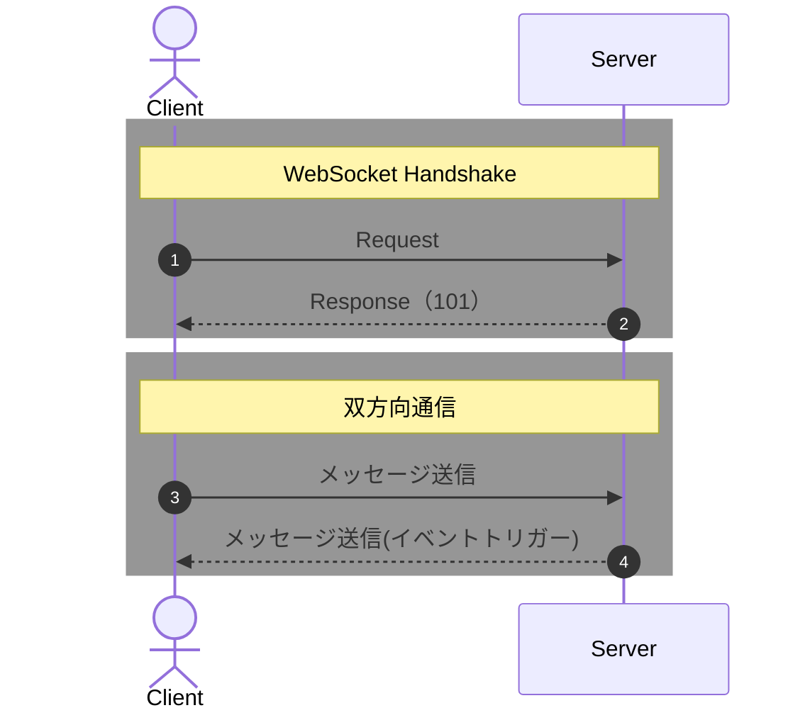

# websocketについて

## websocketとは？

- 双方向通信を低コストで行う仕組み。もっと言えば、サーバーからクライアントに送信したい仕組みの場合に利用する。
  - 例えば、チャット機能。誰かがチャットをしたらサーバーから別ユーザーに対して送信したい。
- `https://`に対して、`ws://`もしくは`wss://`を使用する。
- HTTPと違い、通信したチャネルが常時開いてるのでサーバーからも送信できる。（詳細を調べたい）
- どちらかの接続が遮断されると終了する。



### WebSocket Handshake

- HTTPからWebSocket通信への切り替えをするために送信する。
- この通信はHTTPで行われる。
- websocketへの切り替えは101ステータスを返す。
- リクエストヘッダ(この通信をwebsocketにして〜)
    ```shell
    Upgrade: websocket
    Connection: upgrade
    Sec-WebSocket-Version: 13 # 接続のプロトコルバージョンを指定
    Sec-WebSocket-Key: XXXXXXXXXXXXXXXXXX==
    ```
    - `Sec-WebSocket-Version`はサーバーが対応している必要がある。
    - `Sec-Websocket-Key`は、特定のクライアントとのコネクション確立を証明するために使用する。
- レスポンスヘッダ(切り替えたよ〜)
    ```
    HTTP/1.1 101 OK
    Upgrade: websocket
    Connection: upgrade
    Sec-WebSocket-Accept: ZZZZZZZZZZZZZZZZZZZ==
    ```

### 双方向通信

- todo
  - 実際に実装を試す
  - websocketでやりとりされるデータはどのようになっているか
  - [NTTが公開しているwebsocketについてのスライド](https://www.slideshare.net/slideshow/websocketwebrtc/31698530)

## 他の手法との比較

- 昔はHTTPのロングポーリングを利用して上記を再現していた。
  - ポーリングとは、一定間隔でサーバーからリクエストを行う。
  - ロングポーリングとは、データが更新されたらサーバーからリクエストを行う。

## websocket機能実装の参考URL

- https://zenn.dev/mfunyu/books/ft_transcendence/viewer/websocket2
- https://qiita.com/tamakiiii/items/35a8bfd8bf75b1746eaf