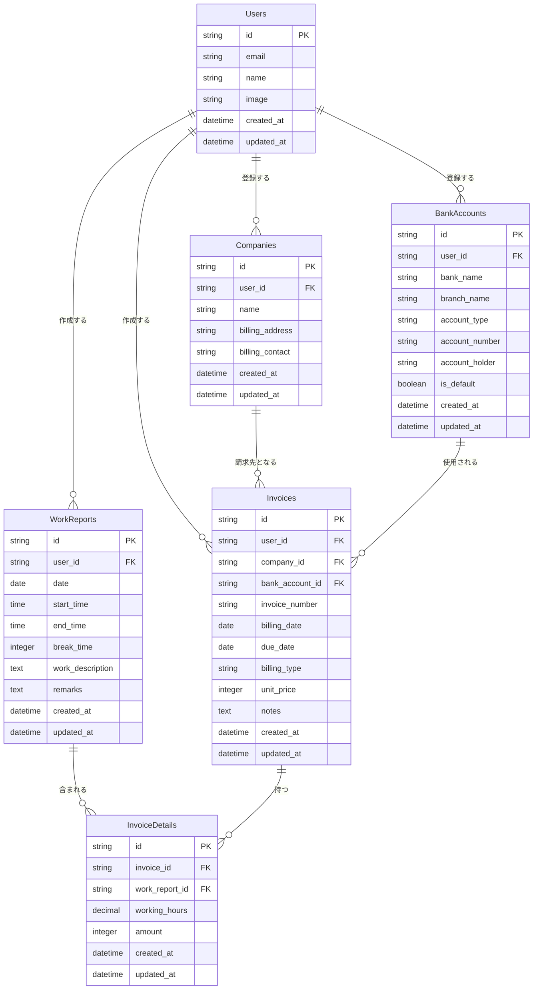

# データベース設計

## ER図

## テーブル定義

### Users（ユーザー）
| カラム名   | 型       | 説明                         | NULL | デフォルト        |
| ---------- | -------- | ---------------------------- | ---- | ----------------- |
| id         | string   | ユーザーの一意識別子（UUID） | NO   | -                 |
| email      | string   | ユーザーのメールアドレス     | NO   | -                 |
| name       | string   | ユーザーの表示名             | NO   | -                 |
| image      | string   | プロフィール画像のURL        | YES  | NULL              |
| created_at | datetime | レコード作成日時             | NO   | CURRENT_TIMESTAMP |
| updated_at | datetime | レコード更新日時             | NO   | CURRENT_TIMESTAMP |

- Google認証で取得した情報を保存
- アプリケーションのユーザー管理用
- emailはGoogle認証時のメールアドレスを使用

### WorkReports（作業報告書）
| カラム名         | 型       | 説明                           | NULL | デフォルト        |
| ---------------- | -------- | ------------------------------ | ---- | ----------------- |
| id               | string   | 作業報告書の一意識別子（UUID） | NO   | -                 |
| user_id          | string   | 作成者のユーザーID（外部キー） | NO   | -                 |
| date             | date     | 作業日                         | NO   | -                 |
| start_time       | time     | 勤務開始時刻                   | NO   | -                 |
| end_time         | time     | 勤務終了時刻                   | NO   | -                 |
| break_time       | integer  | 休憩時間（分単位）             | NO   | 60                |
| work_description | text     | 作業内容の詳細説明             | NO   | -                 |
| remarks          | text     | 備考欄                         | YES  | NULL              |
| created_at       | datetime | レコード作成日時               | NO   | CURRENT_TIMESTAMP |
| updated_at       | datetime | レコード更新日時               | NO   | CURRENT_TIMESTAMP |

- 日次の作業報告を管理
- ユーザーごとの作業内容を記録
- 時間情報は分単位で管理
- 1ユーザーにつき1日1レコード

### Companies（請求先企業）
| カラム名        | 型       | 説明                           | NULL | デフォルト        |
| --------------- | -------- | ------------------------------ | ---- | ----------------- |
| id              | string   | 企業の一意識別子（UUID）       | NO   | -                 |
| user_id         | string   | 登録者のユーザーID（外部キー） | NO   | -                 |
| name            | string   | 企業名                         | NO   | -                 |
| billing_address | string   | 請求先住所                     | NO   | -                 |
| billing_contact | string   | 請求先担当者名                 | YES  | NULL              |
| created_at      | datetime | レコード作成日時               | NO   | CURRENT_TIMESTAMP |
| updated_at      | datetime | レコード更新日時               | NO   | CURRENT_TIMESTAMP |

### Invoices（請求書）
| カラム名        | 型       | 説明                           | NULL | デフォルト        |
| --------------- | -------- | ------------------------------ | ---- | ----------------- |
| id              | string   | 請求書の一意識別子（UUID）     | NO   | -                 |
| user_id         | string   | 作成者のユーザーID（外部キー） | NO   | -                 |
| company_id      | string   | 請求先企業ID（外部キー）       | NO   | -                 |
| bank_account_id | string   | 銀行口座ID（外部キー）         | NO   | -                 |
| invoice_number  | string   | 請求書番号                     | NO   | -                 |
| billing_date    | date     | 請求日                         | NO   | -                 |
| due_date        | date     | 支払期限                       | NO   | -                 |
| billing_type    | string   | 請求タイプ（'hourly'/'daily'） | NO   | 'hourly'          |
| unit_price      | integer  | 単価（時間単価または人日単価） | NO   | -                 |
| notes           | text     | 備考                           | YES  | NULL              |
| created_at      | datetime | レコード作成日時               | NO   | CURRENT_TIMESTAMP |
| updated_at      | datetime | レコード更新日時               | NO   | CURRENT_TIMESTAMP |

### InvoiceDetails（請求書明細）
| カラム名       | 型       | 説明                      | NULL | デフォルト        |
| -------------- | -------- | ------------------------- | ---- | ----------------- |
| id             | string   | 明細の一意識別子（UUID）  | NO   | -                 |
| invoice_id     | string   | 請求書ID（外部キー）      | NO   | -                 |
| work_report_id | string   | 作業報告書ID（外部キー）  | NO   | -                 |
| working_hours  | decimal  | 作業時間（小数点2桁まで） | NO   | -                 |
| amount         | integer  | 金額                      | NO   | -                 |
| created_at     | datetime | レコード作成日時          | NO   | CURRENT_TIMESTAMP |
| updated_at     | datetime | レコード更新日時          | NO   | CURRENT_TIMESTAMP |

### BankAccounts（銀行口座情報）
| カラム名       | 型       | 説明                             | NULL | デフォルト        |
| -------------- | -------- | -------------------------------- | ---- | ----------------- |
| id             | string   | 口座情報の一意識別子（UUID）     | NO   | -                 |
| user_id        | string   | ユーザーID（外部キー）           | NO   | -                 |
| bank_name      | string   | 金融機関名                       | NO   | -                 |
| branch_name    | string   | 支店名                           | NO   | -                 |
| account_type   | string   | 口座種別（'ordinary'/'current'） | NO   | 'ordinary'        |
| account_number | string   | 口座番号（暗号化）               | NO   | -                 |
| account_holder | string   | 口座名義                         | NO   | -                 |
| is_default     | boolean  | デフォルト口座フラグ             | NO   | false             |
| created_at     | datetime | レコード作成日時                 | NO   | CURRENT_TIMESTAMP |
| updated_at     | datetime | レコード更新日時                 | NO   | CURRENT_TIMESTAMP |

## インデックス設計

### Users
| インデックス名  | カラム | 種類   | 説明                                               |
| --------------- | ------ | ------ | -------------------------------------------------- |
| users_email_idx | email  | UNIQUE | メールアドレスの一意性保証、ログイン時の検索効率化 |

### WorkReports
| インデックス名             | カラム          | 種類   | 説明                                           |
| -------------------------- | --------------- | ------ | ---------------------------------------------- |
| work_reports_user_date_idx | (user_id, date) | UNIQUE | 1日1レコードの制約、ユーザー別日付検索の効率化 |
| work_reports_date_idx      | date            | BTREE  | 月別表示の高速化                               |

### Companies
| インデックス名          | カラム          | 種類   | 説明                             |
| ----------------------- | --------------- | ------ | -------------------------------- |
| companies_user_name_idx | (user_id, name) | UNIQUE | ユーザーごとの企業名の一意性保証 |

### Invoices
| インデックス名            | カラム                     | 種類   | 説明                         |
| ------------------------- | -------------------------- | ------ | ---------------------------- |
| invoices_number_idx       | invoice_number             | UNIQUE | 請求書番号の一意性保証       |
| invoices_company_date_idx | (company_id, billing_date) | BTREE  | 企業別請求書検索の効率化     |
| invoices_bank_account_idx | bank_account_id            | BTREE  | 銀行口座別請求書検索の効率化 |

### InvoiceDetails
| インデックス名             | カラム                       | 種類   | 説明                                 |
| -------------------------- | ---------------------------- | ------ | ------------------------------------ |
| invoice_details_report_idx | (invoice_id, work_report_id) | UNIQUE | 同一請求書内での作業報告書の重複防止 |

### BankAccounts
| インデックス名            | カラム                | 種類  | 説明                               |
| ------------------------- | --------------------- | ----- | ---------------------------------- |
| bank_accounts_user_idx    | user_id               | BTREE | ユーザーごとの口座情報検索の効率化 |
| bank_accounts_default_idx | (user_id, is_default) | BTREE | デフォルト口座の検索効率化         |

## バリデーションルール

### WorkReports
| フィールド       | ルール                                                                            |
| ---------------- | --------------------------------------------------------------------------------- |
| date             | ・必須 ・日付形式（YYYY-MM-DD） ・未来日の入力を許可                        |
| start_time       | ・必須 ・時刻形式（HH:MM） ・00:00〜23:59の範囲                             |
| end_time         | ・必須 ・時刻形式（HH:MM） ・start_timeより後の時刻 ・00:00〜23:59の範囲 |
| break_time       | ・必須 ・0以上の整数（分） ・デフォルト値：60分                             |
| work_description | ・必須 ・最大1000文字 ・空白文字のみは不可                                  |
| remarks          | ・任意 ・最大500文字                                                           |

### Companies
| フィールド      | ルール                  |
| --------------- | ----------------------- |
| name            | ・必須 ・最大100文字 |
| billing_address | ・必須 ・最大200文字 |
| billing_contact | ・任意 ・最大50文字  |

### Invoices
| フィールド     | ルール                                |
| -------------- | ------------------------------------- |
| invoice_number | ・必須 ・一意 ・英数字のみ      |
| billing_date   | ・必須 ・日付形式（YYYY-MM-DD）    |
| due_date       | ・必須 ・billing_date以降の日付    |
| billing_type   | ・必須 ・'hourly'または'daily'のみ |
| unit_price     | ・必須 ・0より大きい整数           |

### InvoiceDetails
| フィールド    | ルール                                         |
| ------------- | ---------------------------------------------- |
| working_hours | ・必須 ・0より大きい数値 ・小数点2桁まで |
| amount        | ・必須 ・0以上の整数                        |

### BankAccounts
| フィールド     | ルール                                                    |
| -------------- | --------------------------------------------------------- |
| bank_name      | ・必須 ・最大100文字                                   |
| branch_name    | ・必須 ・最大100文字                                   |
| account_type   | ・必須 ・'ordinary'（普通）または'current'（当座）のみ |
| account_number | ・必須 ・数字のみ ・7桁以内                         |
| account_holder | ・必須 ・最大100文字 ・カタカナまたは漢字           |